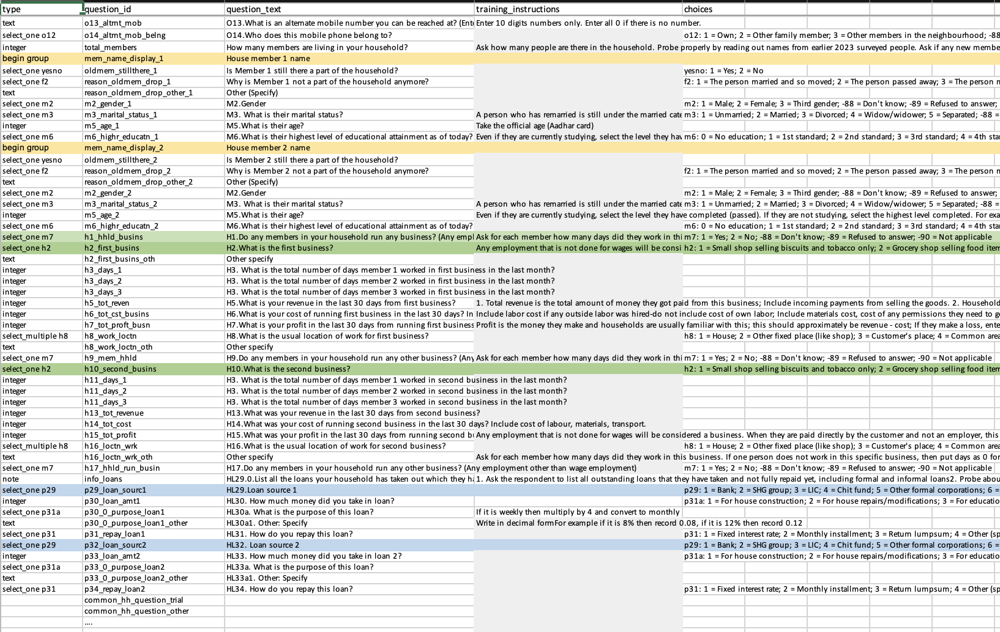
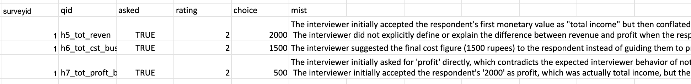

# Survey Audio Audits using LLMs

Surveyors often make mistakes in how they ask questions or how they record responses in the form.

Manual solution: We record audios of the survey as they are happening. An independent auditor listens to 5-10\% of these audios and gives feedback to the surveyor. This is (i) expensive, (ii) slow, and (iii) the auditor does not give great feedback to the surveyor. 

Possible solution: Can we get AI to take the audio file and generate feedback to the surveyor?

While we want to get the 'ideal choice' a surveyor should have entered using interview transcriptions, the feedback we give the surveyor can be categorized into questions that were not asked properly, questions that were not probed properly and questions that were phrased in a leading manner.

## What we tried so far

Inputs required:
- Odia survey interview audios (our survey is in Odia language)
- A csv/Excel file with all questions, instructions associated with each question, choice options for each question

Processes:
- Transcribe the Odia audios and translate to English
- Generate an ideal question-by-question instructions file in json format (input would be the csv file + a survey training audio)
- Generate a question-by-question feedback, including the ideal choice that should have been chosen. Note: this completely hinges on the transcription being correct

Note: Apart from a question-by-question feedback, we did try a direct short concise feedback regarding the overall technique of interviewing, probing and some salient mistakes in interviewing. The only issue with this is that the feedback is quite generic and it picks up certain examples from the transcription on its own, with no insight into how it picks these specific examples.

## 1. Transcription
First step is to transcribe the survey interview audios in Odia/do direct English translations. We chunk the entire 40min-1 hour long audio into 10 min chunks each to do this. Gemini was able to transcribe only 10 min at a time. This reduces the time taken to transcribe too. Note: Sometimes extra Odia characters are in fact seen in the transcripts, which also makes the English translations wrong. Gemini request limits are not exhausted for transcriptions. Prompt used:

```
# Generate transcription
        response = model.generate_content([
            audio_file,
            """This is a survey recording in Odia language. 
            
            Please provide BOTH:
            1. Original Odia transcription
            2. English translation (STRICTLY ENGLISH. NO ODIA OR HINDI CHARACTERS)
            
            Requirements for both:
            - Identify each speaker (e.g., Speaker 1, Speaker 2) or use their names if they introduce themselves
            - Be as accurate as possible with the transcription
            - Format the output clearly
            - Note that there may be some Hindi language phrases used in between, consider those properly
            
            Format your response EXACTLY as:
            
            === ODIA ===
            [Odia transcription here]
            
            === ENGLISH ===
            [English translation here]
            
            Provide only the transcripts without any additional commentary. NEVER HALLUCINATE.
            If some audio is unclear or inaudible, just write "inaudible". Do not put additional characters when something is not clear.
            Do not put the character 45 or any number anywhere. Transcribe whatever is audible.
            Do not mess up numerical responses when someone says a number. Transcribe it properly.
            
            """
        ])

```

## 2. Generating ideal instructions per question

Background: Questions in the interview are separated by members. Eg. If there are 12 members in the house, each question will have # where # is the member number for the member questions roster. Eg. age_1, age_2, age_3, etc. Similar for loans. Eg. loanpurpose_loan5, interestrate_loan5, loanpurpose_loan6, interestrate_loan6. Similar for businesses, we consider 4 businesses. There are total about 500+ questions, including all member-related questions, common house related questions and loan related questions for an average household with 4 members.

Input to generate the instructions file is an Excel sheet with all questions, choices, etc. and also an audio transcription of a surveyor training session.

The Excel sheet containing questions looks like the following:

(Zoom in)



Prompt for getting the instructions file:

```
"""
    Generate evaluation prompt for a single question using Gemini.
    
    Args:
        model: Gemini model instance
        question_id: Question identifier
        question_text: Full question text
        instructions: Training instructions from Excel
        choices: Answer choices for the question
        training_transcript: Full training transcript
        
    Returns:
        Generated evaluation prompt as string
    """
    prompt = f"""You are an expert survey interviewer trainer. Create a detailed evaluation guide for this survey question that will be used to evaluate audio recordings of actual interviews conducted in Odia language.

QUESTION ID: {question_id}
QUESTION TEXT: {question_text}
ANSWER CHOICES: {choices}
TRAINING INSTRUCTIONS: {instructions}

TRAINING TRANSCRIPT CONTEXT (Use details about instructions from this transcript as well):
{training_transcript}

Generate a structured evaluation prompt in JSON format with these sections:
{{
  "question_id": "{question_id}",
  "question_text": "{question_text}",
  "choices": "{choices}",
  "expected_interviewer_behavior": "What the interviewer should say and do",
  "required_elements": ["List of required elements that must be present"],
  "common_mistakes": ["List of common mistakes to watch for"],
  "probing_requirements": ["Required follow-up questions or probing"],
  "evaluation_checklist": [
    {{"criteria": "Specific thing to check", "weight": "importance level"}},
  ],
  "red_flags": ["Critical errors that indicate poor interviewing"],
  "acceptable_variations": ["Acceptable ways to ask the question"],
  "language_considerations": ["Odia language-specific considerations"]
}}

Be specific about what makes a good vs poor interview for this question based on the training materials. Consider that the audio will be in Odia but you should provide evaluation criteria that can be applied regardless of exact wording."""

```

An example of how the instruction file looks in json format:

```json
{
  "question_id": "m14_wages_days_1",
  "question_text": "M14.How many days in the 30 days were they employed for wages/salary?",
  "choices": "nan",
  "expected_interviewer_behavior": "The interviewer must ask the question clearly, referencing the 'last 30 days' timeframe. They must ensure the respondent understands the crucial distinction between 'wage/salary employment' (working for someone else) and 'business/self-employment' (working for oneself). They should be prepared to probe extensively based on the respondent's job type to correctly classify their work and accurately record the number of days as per the specific counting rules for salaried vs. daily wage workers.",
  "required_elements": [
    "Clearly state the reference period: 'last 30 days' (ଗତ ୩୦ ଦିନରେ).",
    "Use the specific terms for 'wages' (ମଜୁରୀ / majuri) and 'salary' (ଦରମା / darama).",
    "Emphasize that the question is only about work done for an employer, not for one's own business."
  ],
  "common_mistakes": [
    "Incorrectly including days worked in a personal business (e.g., a self-employed auto driver, a shop owner, a gupchup seller).",
    "Forgetting the '30-day rule' for monthly salaried employees and instead recording the number of working days (e.g., 22-26 days).",
    "Failing to probe when a respondent gives an ambiguous job title like 'driver' or 'mason,' which could be either wage labor or self-employment.",
    "Using the less precise term 'last month' (ଗତ ମାସରେ) instead of 'last 30 days' (ଗତ ୩୦ ଦିନରେ)."
  ],
  "probing_requirements": [
    {
      "condition": "Respondent mentions an ambiguous job (e.g., driver, auto driver, painter, mason, tailor).",
      "probe": "Interviewer MUST ask clarifying questions to determine the employment structure. Example probes: 'Do you work for a specific person or company who pays you, or do you find your own customers and work for yourself?' (ଆପଣ କୌଣସି ନିର୍ଦ୍ଦିଷ୍ଟ ବ୍ୟକ୍ତି କିମ୍ବା କମ୍ପାନୀ ପାଇଁ କାମ କରନ୍ତି ଯିଏ ଆପଣଙ୍କୁ ଦରମା ଦିଅନ୍ତି, ନା ଆପଣ ନିଜେ ଗ୍ରାହକ ଖୋଜି ନିଜ ପାଇଁ କାମ କରନ୍ତି?) or 'Is this your own auto/shop, or are you employed by someone to work here?'"
    },
    {
      "condition": "Respondent confirms they receive a fixed monthly salary.",
      "probe": "Interviewer must confirm that the correct entry is 30 days. Example probe: 'Since you receive a monthly salary, we will include paid holidays like Sundays. So, we will record it as 30 days, is that correct?' (ଯେହେତୁ ଆପଣ ମାସିକ ଦରମା ପାଆନ୍ତି, ଆମେ ଏଥିରେ ରବିବାର ଭଳି ଛୁଟିଦିନକୁ ମଧ୍ୟ ଗଣିବୁ। ତେଣୁ ଆମେ ଏହାକୁ ୩୦ ଦିନ ବୋଲି ଲେଖିବୁ, ଠିକ୍ ଅଛି?)"
    },
    {
      "condition": "Respondent confirms they work for daily wages.",
      "probe": "Interviewer must ask for the exact count of days. Example probe: 'Out of the last 30 days, on exactly how many days did you go to work?' (ଗତ ୩୦ ଦିନ ମଧ୍ୟରୁ, ଆପଣ ଠିକ୍ କେତେ ଦିନ କାମ କରିବାକୁ ଯାଇଥିଲେ?)"
    }
  ],
  "evaluation_checklist": [
    {
      "criteria": "Did the interviewer use the correct 'last 30 days' reference period?",
      "weight": "High"
    },
    {
      "criteria": "Did the interviewer clearly distinguish this question is about 'wages/salary' and not 'business'?",
      "weight": "Critical"
    },
    {
      "criteria": "If the member was salaried, did the interviewer correctly guide towards and record 30 days?",
      "weight": "High"
    },
    {
      "criteria": "If the member was a daily wage laborer, did the interviewer ask for and record the actual number of days worked?",
      "weight": "High"
    },
    {
      "criteria": "Did the interviewer probe effectively when faced with an ambiguous job title (like driver or mason) to classify it correctly?",
      "weight": "Critical"
    },
    {
      "criteria": "Did the interviewer maintain a neutral and professional tone while probing?",
      "weight": "Medium"
    }
  ],
  "red_flags": [
    "Recording any number other than 30 for a full-time, monthly salaried employee without a very strong justification noted in the comments.",
    "Accepting a response for a self-employed role (e.g., 'I drive my own auto') and recording it under this question instead of clarifying that it will be covered in the business module.",
    "Completely failing to probe on ambiguous job titles, leading to likely data contamination.",
    "Showing confusion between the definitions of wage labor and business, thereby confusing the respondent."
  ],
  "acceptable_variations": [
    "Instead of a single question, the interviewer can break it down: 'First, I'd like to ask about any work you do for a salary or a daily wage for someone else. In the last 30 days, how many days did you do this type of work?'",
    "Proactively clarifying the distinction: 'This question is not about your own shop/business, which we will ask about later. This is only about work where you are an employee. In the last 30 days, how many days did you work as an employee?'"
  ],
  "language_considerations": [
    "The training explicitly uses 'majuri' (ମଜୁରୀ) for wages and 'darama' (ଦରମା) for salary. The interviewer should use these specific terms to ensure clarity.",
    "The concept of a wage laborer versus a contractor ('thekedar') is a key distinction. The interviewer's language must accurately reflect this difference to classify the work correctly.",
    "The interviewer must use the precise phrase 'gata 30 dinare' (ଗତ ୩୦ ଦିନରେ) for 'in the last 30 days,' as instructed in the training, to avoid the ambiguity of 'gata masare' (in the last month)."
  ]
}
```
## 3. Getting ideal choices and feedback per question

The instructions file and the transcript are the two inputs for this. 
One prompt used for this process:

```
# ============================================================
# question by question evaluation
# ============================================================

def evaluate_question(
    question_id: str,
    question_data: Dict[str, Any],
    transcript: str,
    model: Any
) -> Dict[str, Any]:
    """
    Evaluate a single question against the transcript using Gemini.
    """
    choices = question_data.get('choices', 'N/A')

    prompt = f"""
You are a survey quality auditor.

Evaluate ONLY this question.

QUESTION ID: {question_id}

QUESTION TEXT:
{question_data['question_text']}

ANSWER CHOICES:
{choices}

EXPECTED INTERVIEWER BEHAVIOR:
{question_data['expected_interviewer_behavior']}

REQUIRED ELEMENTS:
{json.dumps(question_data['required_elements'], ensure_ascii=False)}

COMMON MISTAKES:
{json.dumps(question_data['common_mistakes'], ensure_ascii=False)}

FULL INTERVIEW TRANSCRIPT (English):
{transcript}

CRITICAL INSTRUCTIONS:
- Be ACCURATE and FACTUAL - only use information present in the transcript
- DO NOT hallucinate or make up information
- If you cannot find this question in the transcript, set "was_question_asked" to false and "quality_rating" to "Not Asked"
- Only quote text that actually appears in the transcript
- If the question is not present, state "Question not found in transcript" in the overall_assessment
- When in doubt, err on the side of marking something as not present rather than inventing evidence

IMPORTANT - LEADING QUESTION GUIDANCE:
- A question is only considered "leading" if it suggests a particular answer for an OPINION-based question
- Verification questions (e.g., "Your mobile number is xyz, right?") are NOT leading - they are confirmatory
- Factual confirmations are acceptable and should not be flagged as leading
- Only flag as leading if the question pushes the respondent toward a specific opinion or subjective response

For the choice fields:
- "ideal_choice": Based on what the respondent actually said in the transcript, determine which choice from the provided ANSWER CHOICES should have been selected
- IMPORTANT: Both fields must use the exact choice text/number from the ANSWER CHOICES provided above
- If the question was not asked, set it to "N/A"
- Handling numeric / open-ended responses:
    - If the question expects a numeric or open-ended value (e.g., income, salary, age, amount, distance, time) and discrete ANSWER CHOICES are not applicable, then extract the exact numeric value stated by the respondent in the transcript and enter that value directly (e.g., 200, 35, 1500). 
    - Do not convert numeric answers into categories unless explicit ANSWER CHOICES are provided.
    - If the respondent gives a range, enter the midpoint of that range. If the question was not asked, still enter "N/A" 

#CLEARLY DISTINGUISH BETWEEN EACH MEMBERS. THERE ARE SEPARATE VARIABLES GIVEN FOR QUESTIONS FOR EACH MEMBERS. FOLLOW THE MEMBER INDICES.
# If respondent is member1, then other members such as daughter, son etc. are member2, member3 respectively. Variables ending in _1 are for member1, _2 for member2 and so on.
DO NOT JUMBLE UP MEMBERS. There can be references to other members in the responses. Decode it properly.
Return STRICT JSON ONLY in this exact schema:

{{
  "question_id": "{question_id}",
  "was_question_asked": true or false,
  "quality_rating": "Good | Partial | Poor | Not Asked",
  "evidence_from_transcript": "Exact quotes from transcript, or 'N/A' if question not found",
  "ideal_choice": "The correct answer choice that should have been selected based on what the respondent actually said in the transcript, or 'N/A'",
  "missing_elements": [],
  "mistakes_observed": [],
  "overall_assessment": "Short evaluator summary, or 'Question not found in transcript' if not present"
}}
"""

    response = model.generate_content(prompt)

    if not response.text.strip().startswith("{"):
        print("\n RAW GEMINI OUTPUT (for debugging):\n")
        print(response.text)
        print("\n END RAW OUTPUT\n")

    return extract_json(response.text)
```
Another prompt tried for this process: (this prompt is slightly more concise, without the evidence from the transcript - to reduce the number of tokens). Problems with feedback do not reduce even if we use the entire Prompt 1 with 'evidence from transcript'.

```
prompt = f"""
You are a survey quality auditor.

Evaluate ONLY this question.

QUESTION ID: {question_id}

QUESTION TEXT:
{question_data['question_text']}

ANSWER CHOICES:
{choices}

EXPECTED INTERVIEWER BEHAVIOR:
{question_data['expected_interviewer_behavior']}

REQUIRED ELEMENTS:
{json.dumps(question_data['required_elements'], ensure_ascii=False)}

COMMON MISTAKES:
{json.dumps(question_data['common_mistakes'], ensure_ascii=False)}

FULL INTERVIEW TRANSCRIPT (English):
{transcript}

CRITICAL INSTRUCTIONS:
- Be ACCURATE and FACTUAL - only use information present in the transcript
- DO NOT hallucinate or make up information
- If you cannot find this question in the transcript, set "was_question_asked" to false and "quality_rating" to "Not Asked"
- Only quote text that actually appears in the transcript
- If the question is not present, state "Question not found in transcript" in the overall_assessment
- When in doubt, err on the side of marking something as not present rather than inventing evidence
- If there is "inaudible" in the transcript, mark choices and mistakes as N/A for that question

IMPORTANT - LEADING QUESTION GUIDANCE:
- A question is only considered "leading" if it suggests a particular answer for an OPINION-based question
- Verification questions (e.g., "Your mobile number is xyz, right?") are NOT leading - they are confirmatory
- Factual confirmations are acceptable and should not be flagged as leading
- Only flag as leading if the question pushes the respondent toward a specific opinion or subjective response

For the choice fields:
- "ideal_choice_based_on_response": Based on what the respondent actually said in the transcript, determine which choice from the provided ANSWER CHOICES should have been selected
- IMPORTANT: Both fields must use the exact choice text/number from the ANSWER CHOICES provided above
- If the question was not asked, set it to "N/A"
- Handling numeric / open-ended responses:
    - If the question expects a numeric or open-ended value (e.g., income, salary, age, amount, distance, time) and discrete ANSWER CHOICES are not applicable, then extract the exact numeric value stated by the respondent in the transcript and enter that value directly (e.g., 200, 35, 1500). 
    - Do not convert numeric answers into categories unless explicit ANSWER CHOICES are provided.
    - If the respondent gives a range, enter the midpoint of that range. If the question was not asked, still enter "N/A" 

#CLEARLY DISTINGUISH BETWEEN EACH MEMBERS. THERE ARE SEPARATE VARIABLES GIVEN FOR QUESTIONS FOR EACH MEMBERS. FOLLOW THE MEMBER INDICES.
# If respondent is member1, then other members such as daughter, son etc. are member2, member3 respectively.
DO NOT JUMBLE UP MEMBERS. There can be references to other members in the responses. Decode it properly.
Return STRICT JSON ONLY in this exact schema:

RATING SCALE:
- 3 = Good
- 2 = Partial
- 1 = Poor
- 0 = Not Asked

Return STRICT JSON ONLY in this exact schema:

{{
  "qid": "{question_id}",
  "asked": "t or f",
  "rating": number from 0 to 3,
  "choice": "The correct answer choice based on respondent's actual response, or 'N/A'",
  "mist": ["Max 2 sentences describing ONLY if mistakes were made. If no mistakes made, then keep empty."]
}}
"""

```

We were using multiprocessing for the same using multiple API keys:

```
import os
import re
import json
import pandas as pd
import google.generativeai as genai
from typing import Dict, Any, List, Optional, Tuple
from multiprocessing import Pool
from glob import glob

# THIS GENERATES THE LONG CONCISE FEEDBACK

# ============================================================
# config
# ============================================================

# List of API keys - one per parallel process
GEMINI_API_KEYS = [
    "Key1",
    "Key2
]


```

```

    # Create args for parallel processing
    process_args = [
        (
            transcript_file,
            GEMINI_API_KEYS[i % num_keys],
            member_count,
            BASE_OUTPUT_PATH
        )
        for i, (transcript_file, member_count) in enumerate(files_with_member_counts)
    ]
    
    # Print assignment summary
    print("\n[ASSIGNMENT] File -> API Key Assignment:")
    for i, (transcript_file, member_count) in enumerate(files_with_member_counts):
        key_index = i % num_keys
        metadata = parse_transcript_filename(transcript_file)
        label = f"{metadata['city_code']}_{metadata['family_code']}"
        print(f"   {label} -> Key #{key_index + 1} (members: {member_count})")
    
    # Process in parallel
    num_to_process = len(files_with_member_counts)
    num_workers = min(num_keys, num_to_process)
    print(f"\n[WORKERS] Starting {num_workers} parallel workers...")
    print("=" * 60)
    
    with Pool(processes=num_workers) as pool:
        pool.map(process_single_file_with_csv, process_args)
    
    print(f"\n[DONE] Batch complete: {num_to_process} files processed")
    
    return num_to_process


```
## 4. Output
We get a csv file in the following manner:



## 5. Issues

### 5.1 Transcription wrong, so feedback and ideal choice wrong

Example:
Audio snippet given in the folder (51_sampleaudiomistake.m4a)

(Note: The part about rooms, as given in the following transcription starts around 00:16).

Transcription:
```
Speaker 2: Yes, a lock.
Speaker 1: It has one, a wooden door with a bidding key lock. How is the wiring in your house? Is it inside the wall or are all the wires outside?
Speaker 2: In all the houses, everyone's wires are inside, in all the rooms.
Speaker 1: Excluding the veranda and toilet, how many rooms do you have for keeping things? How many rooms are there?
Speaker 2: One.
Speaker 1: Okay, how many windows do you have in your house?
Speaker 2: Two. Two windows.
Speaker 1: There are three windows. Okay, were you living in this house during last year's monsoon season?
Speaker 2: We were living in this house.
Speaker 1: Okay, if you think about last year's monsoon season, I'm giving you some options. Tell me which problems you faced last year during the monsoon. Did water leak from the roof?

```
In the above case: there are actually 4 rooms, not one. One can hear the 4 as well.

### 5.2 Transcription correct but feedback picked up wrong

Most audios have music playing in the background, long pauses in between, dogs barking, multiple people talking, going back and forth on a number to ascertain the correct one - all these get picked up in the transcription. In cases like these, a second problem arises that feedback file picks up the wrong phrases. Note: The audio snippet given above was still much better compared to some other audios in which there is a lot of ambient noise.

(5.1) is more prevalent than (5.2)

### 5.3 Differentiating between each member/business/loan questions

Since we have an _# for question related to every member/business/loan, some times it picks up the wrong information for the wrong person or we are just left with a lot of N/As or empty responses.

### 5.4 Request limit exhaustion 

The instruction file with 12 members, 6 loans and 5 businesses is more than 60,000 lines of text. So if a household has just 4 members, we pull in only the instruction file with 4 member member-roster and generate the feedback. This is done to reduce the input characters. However, we end up exhausting per minute request limits and token limits on one key entirely when we do this process. Generating each feedback file takes 2 hours (without parallel processing).


